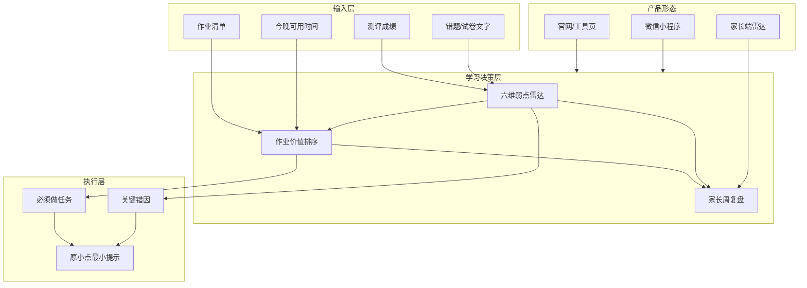
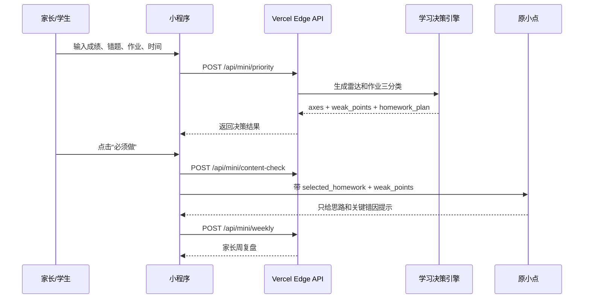

# 技术架构

> 原点智学 · 家庭学习决策系统

目标不是做一个通用聊天老师，而是把家庭晚间学习变成可判断、可取舍、可复盘的闭环。

## 总体架构



## 核心链路



## 服务端接口

| 接口 | 作用 | 当前原则 |
|---|---|---|
| `POST /api/mini/session` | 小程序会话 | 支持低成本本地体验，后续可接真实 openid |
| `POST /api/mini/priority` | 雷达与作业三分类 | 返回分数、弱点、任务优先级、解释证据 |
| `POST /api/mini/content-check` | 内容安全前置检查 | 阻断代写、直接答案、自伤等风险 |
| `POST /api/mini/tutor-message` | 原小点执行端 | 不代写，只做必须做任务和关键错因 |
| `POST /api/mini/weekly` | 家长周复盘 | 输出本周重点、负担判断、家长话术 |

## 决策引擎

首版采用可解释规则引擎：

1. 成绩折算为基础能力分。
2. 错题和作业文字命中六维关键词。
3. 六维雷达按命中弱点扣分。
4. 作业按错题复盘、基础题、应用题、机械重复、当前弱点等因素排序。
5. 输出“必须做 / 灵活选择 / 可以跳过”，并附上证据链。

这不是最终壁垒。真正壁垒应逐步沉淀为：

- 学生弱点画像。
- 错因 taxonomy。
- 作业价值排序数据。
- 家长复盘留存数据。
- 主流教材知识图谱。

## 小程序架构

```text
miniprogram/
  pages/home        今日入口
  pages/tools       诊断入口
  pages/upload      作业/试卷录入
  pages/radar       家长雷达 + 三分类 + 周复盘
  pages/tutor       原小点执行端
  pages/profile     家长资料和内测咨询
  pages/legal       隐私、协议、未成年人保护
  utils/api.js      小程序 API 封装
  utils/storage.js  本地状态
```

## 合规底线

- AI 内容必须明确为辅助建议。
- 不承诺固定学习结果。
- 不提供作业代写或考试作弊。
- 未成年人使用需家长或监护人同意。
- 相册/摄像头仅按用途说明收集，不默认上传用于识别。
- 首版不接支付，降低审核和合规复杂度。

## 部署与验证

```bash
npm run miniapp:fullcheck
npm run miniapp:fullcheck -- --remote
```

远端检查覆盖：

- `https://yuandianzhixue.com`
- `/api/mini/session`
- `/api/mini/priority`
- `/api/mini/content-check`

## 当前阶段判断

当前是“可上架验证”的产品，不是规模化增长阶段。下一阶段的关键不是堆功能，而是拿 20 个真实家庭样本校准三件事：

1. 雷达弱点是否符合家长和孩子体感。
2. 必须做任务是否真的减少无效作业。
3. 周复盘是否能带来连续使用。


## 壁垒路线补充

详见 `docs/MOAT-ROADMAP.md`。当前已经落地三类壁垒种子：错因 taxonomy、作业价值排序向量、家庭反馈校准契约。

新增关键接口：

| 接口 | 作用 | 壁垒意义 |
|---|---|---|
| `POST /api/mini/feedback` | 家长标记作业分类“准/不准” | 形成后续排序模型训练样本 |
| `misconception_profile` | 从测评/作业文本抽取错因标签 | 把普通文本转成可积累的学习画像 |
| `priority_vector` | 为每条作业输出排序特征 | 让“必须做/可跳过”可解释、可校准 |
| `calibration_key` | 连接作业、弱点、错因和反馈 | 用于统计哪类判断经常准或不准 |

真正壁垒要靠 20 个以上真实家庭样本持续校准形成，不能只靠规则或大模型包装。
