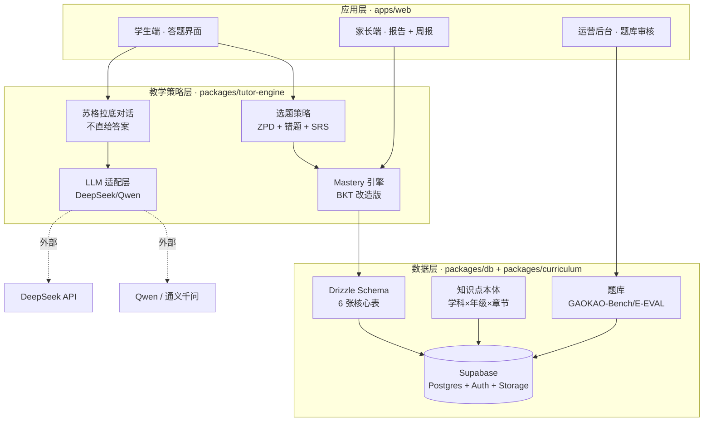
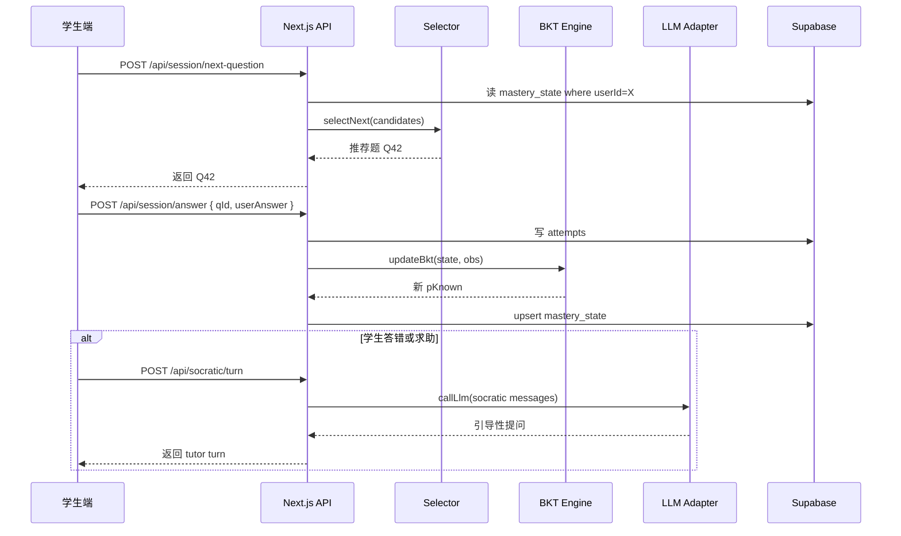

# 技术架构

> 原点 AI 私教 · 应试提分 AI 私教
> 单一目标：把分数提上去。任何不为这个目标服务的特性，砍。

## 三层架构

## 调用链：一次答题完整链路

## 8 件套壳清单 — 上层产品如何对接

「8 件套壳」指 8 个面向不同用户场景的轻量上层包装，全部复用同一套教学引擎：

| 套壳 | 入口 | 用户 | 核心 hook | 数据流 |
|---|---|---|---|---|
| 1. **应试通** | `/student/practice` | K12 学生 | `selectNext` + `socratic` | mastery → selector → llm |
| 2. **错题本** | `/student/wrongbook` | K12 学生 | `attempts where result='incorrect'` | DB 直读 |
| 3. **每日 5 题** | `/student/daily` | K12 学生 | 选 5 题命中 ZPD 黄金区 | selector with `topK=5` |
| 4. **周报** | `/parent/weekly` | 家长 | mastery delta + 错题热区 | DB 聚合 |
| 5. **冲刺模考** | `/student/mock-exam` | 高三 | 真题套卷 + 时间限制 | DB + timer |
| 6. **知识点闯关** | `/student/quest` | 初中 | 按 ontology 树解锁 | curriculum + mastery |
| 7. **拍照求解** | `/student/snap` | K12 学生 | OCR + 苏格拉底 | Qwen-vl + socratic |
| 8. **教研后台** | `/ops/curriculum` | 内部 | ontology 编辑 + 题库审 | DB 直写 |

## 技术决策（详见 DECISIONS.md）

- **Next.js 14 App Router + RSC**：服务端拉数据，前端只渲染，省一层 BFF
- **Supabase**：auth + Postgres + Storage 一把抓，省运维
- **Drizzle ORM**：强类型 + SQL-first，迁移可读
- **BullMQ 暂不引入**：MVP 没有长跑任务，等 OCR/批改场景再加
- **pnpm workspaces**：monorepo 标配，比 turbo 轻

## 性能预算

| 路径 | 目标 | 兜底 |
|---|---|---|
| 选下一题 | < 80ms | DB 索引 + Redis cache mastery |
| BKT 更新 | < 20ms | 纯计算 + 单条 upsert |
| 苏格拉底 1 轮 | < 3s | 流式响应 + 短 prompt |
| GAOKAO 评测单题 | < 8s | 不在用户路径，离线跑 |

## 安全底线

- 所有 LLM 调用**仅从服务端**发出，浏览器不触碰 API key
- Supabase RLS 默认开启，每张表都有「用户只能读自己的数据」策略
- 家长查孩子数据走显式授权链：`users.parent_id` 指向才放行
- 题目原文 / 答案 / 学生作答 全部加密存储（Supabase 默认 AES-256）
