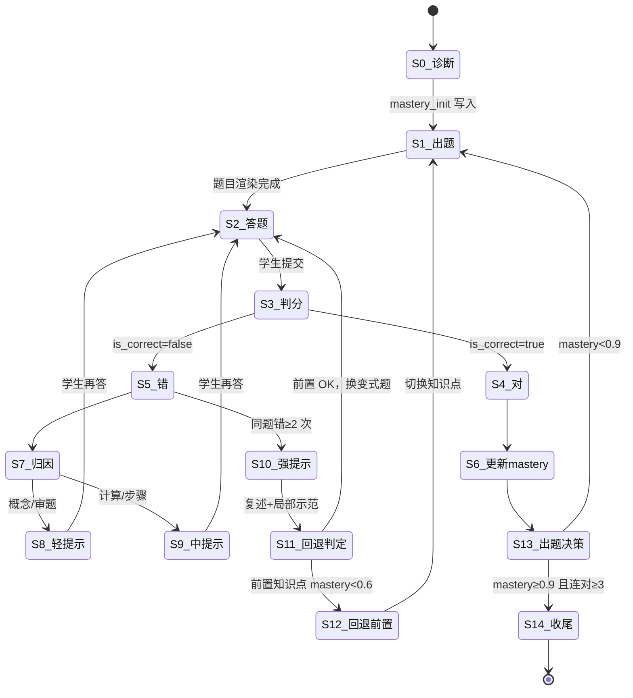

# Phase 1 · 单知识点 25 分钟闭环设计

**产品**：原点 AI 私教
**单元**：一元一次方程（初一）
**目标**：mastery 0.3 → 0.9+ in 25 min
**作者**：Alex（PM）
**日期**：2026-04-25
**版本**：v0.1

---

## 0. 一句话定义

学生进来一个知识点不会，25 分钟后系统判定 90% 掌握，期间 AI 不直接给答案，只用问题引导。每次答题留痕，喂回 BKT 模型，难度自适应。

---

## 1. 核心数据流（状态机）



---

## 2. 状态机详细规范

### S0 · 诊断
- **进入**：学生点击「开始练习」
- **退出**：mastery_init 写入 DB
- **UI**：3 道前测题（易/中/中），无提示，单选+填空混排
- **数据**：写 `mastery_state(student_id, kp_id, prob, updated_at)`，初值用 pyBKT 跑前测响应
- **失败**：3 道全错 → mastery_init = 0.1，触发 S12 回退到「整式运算」前置

### S1 · 出题
- **进入**：S0 完成 或 S6/S12 回流
- **退出**：题目+解析渲染到前端
- **UI**：题目区顶部、计时器右上、mastery 进度条左上
- **数据**：从 `questions` 表按 `kp_id + difficulty ∈ [mastery-0.1, mastery+0.15]` 取 1 题
- **失败**：题库该难度 0 题 → 放宽 ±0.2，仍空 → 报警 + 用兜底题

### S2 · 答题
- **进入**：S1 渲染完
- **退出**：学生点提交 或 60s 无操作触发软提醒
- **UI**：答题区 + 三档提示按钮 + 提交
- **数据**：记录 `start_ts`，每次按提示按钮记 `hint_level ∈ {1,2,3}`
- **失败**：120s 无答 → 自动进 S10 强提示

### S3 · 判分
- **进入**：学生提交
- **退出**：is_correct 计算完
- **UI**：1.5 秒 loading（最多）+ 流式输出反馈
- **数据**：填空题正则+SymPy 化简比对；选择题字符串比对；主观步骤题走 DeepSeek
- **失败**：DeepSeek 超时 2s → 用规则兜底「答案为 x=3，你的答案 x=4，对不上」

### S4 · 对
- **进入**：S3 判 true
- **退出**：mastery 更新完
- **UI**：绿色勾 + 一句话点评（不是「真棒」，是「这步合并同类项干净」）
- **数据**：`responses` 表插入 + BKT 更新 mastery

### S5 · 错
- **进入**：S3 判 false
- **退出**：归因完
- **UI**：黄色感叹号（不用红叉，避免羞耻感）
- **数据**：调用归因 prompt

### S6 · 更新 mastery
- pyBKT update：`P(L_t) = P(L_{t-1}|obs) + (1-P(L_{t-1}|obs)) × P(T)`
- 写 `mastery_state`

### S7 · 归因
- **退出**：4 类标签之一 写入 `responses.error_type`
- **UI**：内部状态，学生不可见
- **数据**：DeepSeek 输出 `{type: 概念|计算|审题|步骤, evidence: ...}`
- **失败**：归因失败 → 默认「步骤」（最常见类）

### S8 · 轻提示
- 触发：error_type ∈ {概念, 审题}
- 文案：「再读一遍题，问自己：题里给了几个条件？要求的是 x 还是 x 的值？」
- **不给方向，只给元问题**

### S9 · 中提示
- 触发：error_type ∈ {计算, 步骤}
- 文案：「移项时符号变了吗？把 +3x 移到右边应该变成什么？」
- **指向具体步骤但不算给学生看**

### S10 · 强提示
- 触发：同题错 ≥2 次 或 120s 无答
- 文案：先示范同结构变式题前 2 步，要求学生**复述**这 2 步，再让他做原题剩余部分
- **复述是关键，不复述不给做**

### S11 · 回退判定
- 查 `prerequisite(kp_id)` → 拉前置 kp 的 mastery
- 任一前置 < 0.6 → S12
- 都 ≥ 0.6 → 回 S2 换变式题

### S12 · 回退前置
- 切 kp_id 到前置（例：一元一次方程 → 移项 / 合并同类项）
- 弹卡片：「这题卡住，咱们先把『移项』搞清楚，3 分钟回来」
- 前置达 0.7 后自动跳回原 kp

### S13 · 出题决策
- mastery ≥ 0.9 且最近 3 题连对 → S14
- mastery ≥ 0.9 但有错 → 出 1 道高难度巩固
- mastery < 0.9 → 继续出题

### S14 · 收尾
- UI：放鞭炮动画（克制，不刺眼）+ 25 分钟时间线回放（哪几道卡住、哪几道秒过）
- 写 `session_summary`，触发家长端推送

---

## 3. Prompt 链设计（DeepSeek 中文 prompt）

### 3.1 诊断 prompt

```
你是初中数学老师，正在评估学生当前对「{知识点名}」的掌握水平。

学生最近 {N} 次答题历史：
{history_json}

每条记录字段：题目难度（0-1）、是否答对、用时秒数、用了几次提示。

输出 JSON：
{
  "mastery_prob": 0.0-1.0 之间的小数，
  "weak_subskills": ["移项", "合并同类项"] 这种具体子技能数组,
  "reasoning": "一句话说明判断依据，不超过 30 字"
}

判断原则：
- 答对但用时长 + 多次提示 → mastery 不超过 0.5
- 连对 3 题且无提示 → mastery 至少 0.8
- 没有历史 → 默认 0.3
```

### 3.2 出题 prompt（仅在题库无合适题时兜底用，主路径走 SQL）

```
为初一学生生成 1 道「一元一次方程」练习题。

约束：
- 难度系数：{target_difficulty}（0=最易 1=最难）
- 题型：{填空 | 选择 | 解答}
- 避开学生已做过：{question_ids_done}
- 涉及子技能：{subskills}（例：移项、去括号）

输出 JSON：
{
  "stem": "题目文字，方程用 LaTeX 包裹 $...$",
  "answer": "标准答案，方程解写成 x=数值",
  "solution_steps": ["步骤 1", "步骤 2", "步骤 3"],
  "difficulty": 0.0-1.0,
  "prerequisites": ["移项", "合并同类项"]
}

禁止：故事背景超过 20 字（孩子嫌啰嗦）、生僻符号、超纲内容。
```

### 3.3 判分+归因 prompt

```
你在批改初一学生的方程题。

题目：{stem}
标准答案：{answer}
标准解法：{solution_steps}
学生答题过程：{student_response}

第一步：判断对错（is_correct: true/false）。

第二步：若错，归到下面 4 类之一：
- 概念：不知道方程是什么、不知道未知数含义、把方程当算式
- 计算：移项符号错、加减乘除算错、分数通分错
- 审题：题目要求 x 的值学生写了 x+1、漏看条件、单位不一致
- 步骤：步骤跳跃、漏写关键步、顺序错

输出 JSON：
{
  "is_correct": true/false,
  "error_type": "概念|计算|审题|步骤" 或 null,
  "evidence": "学生在哪一步出错，原话引用，≤30 字",
  "comment": "给学生看的一句话点评，温和但不假，≤25 字"
}

点评示例：
- 对：「移项这步符号处理得对」
- 错：「移项时 +3 应该变成 -3，再试一次」
禁止：「真棒」「加油」「相信你」这种空话。
```

### 3.4 苏格拉底引导 prompt（轻/中提示）

```
你是苏格拉底式数学老师。学生刚做错了下面这道题。

题目：{stem}
学生的错误答案：{student_response}
错误类型：{error_type}
当前提示档位：{hint_level}（1=轻 2=中）

任务：用 1-2 个反问句引导学生自己发现错误。绝对不能直接给答案或正确步骤。

档位 1（轻）规则：
- 只问元问题，例：「这题让你求什么？」「方程两边平衡了吗？」
- 不指向具体步骤

档位 2（中）规则：
- 可以指向具体步骤，例：「移项时符号怎么变？」「这一步合并同类项后右边等于多少？」
- 仍然以问号结尾，不给陈述句答案

输出 JSON：
{
  "question": "你要问学生的话，≤40 字",
  "expected_thinking": "你期待学生想到什么，给系统记录用，学生看不到"
}

铁律：
- 输出必须以「？」结尾
- 禁止出现「答案是」「应该」「正确的做法」这种词
- 禁止超过 2 句
```

### 3.5 强提示 prompt（局部示范+复述）

```
学生在「{知识点}」这道题上已经错了 2 次以上，需要给局部示范。

题目：{stem}
标准解法前 2 步：{first_two_steps}

任务：
1. 演示一道**结构相同但数字不同**的变式题的前 2 步
2. 让学生复述这 2 步的关键操作
3. 让学生用同样方法做原题剩下部分

输出 JSON：
{
  "demo_question": "变式题题干",
  "demo_step_1": "示范第 1 步，含计算过程",
  "demo_step_2": "示范第 2 步",
  "ask_student_to_restate": "请你用自己的话说说，这 2 步分别在做什么？",
  "back_to_original": "现在回到原题，第 3 步该怎么做？"
}

要求：
- 变式题数字简单，让学生注意力在方法不在算
- 复述请求必须在示范之后，不能跳过
- 示范完不直接讲完整解法，留 50% 给学生
```

### 3.6 回退 prompt

```
学生在「{当前 kp}」反复卡住，需要判断是否回退到前置知识点。

当前 kp 前置依赖图：{prerequisites_with_mastery}
学生最近 5 次答题错误归因分布：{error_dist}

判断：
- 若任一前置 mastery < 0.6 → 回退到该前置
- 若错误集中在「计算」 → 回退到「有理数运算」
- 若错误集中在「概念」 → 回退到最相关的概念前置
- 都 OK → 不回退，换变式题继续

输出 JSON：
{
  "should_fallback": true/false,
  "target_kp_id": "kp_xxx" 或 null,
  "explain_to_student": "给学生的话，≤30 字，例：『这题卡住是因为移项还不熟，咱们先回去练 3 分钟移项』"
}

要求：
- 解释给学生时不要说「你不会」，说「咱们先把 X 搞熟」
- 永远以「回来继续」收尾，让学生知道是绕路不是放弃
```

---

## 4. UI 草图

### 4.1 学生主界面

```
┌────────────────────────────────────────────────────────────────┐
│ 原点私教                                            00:12:34  │
├────────────────────────────────────────────────────────────────┤
│                                                                │
│ 一元一次方程 ▸ 移项                                            │
│ ▓▓▓▓▓▓▓▓▓▓▓▓▓▓▓░░░░░░░░░  68% 掌握                         │
│                                                                │
├────────────────────────────────────────────────────────────────┤
│                                                                │
│  第 4 题（连对 2 道，再来 1 道就升档）                         │
│                                                                │
│  解方程：3x + 5 = 2x + 12                                      │
│                                                                │
│  ┌──────────────────────────────────────────────────────────┐ │
│  │                                                          │ │
│  │  x =                                                     │ │
│  │                                                          │ │
│  └──────────────────────────────────────────────────────────┘ │
│                                                                │
│  [💡 轻提示]  [🔍 中提示]  [📖 强提示]      [ 提交 ]          │
│                                                                │
├────────────────────────────────────────────────────────────────┤
│ 反馈区                                                         │
│                                                                │
│ AI 老师：移项这步符号处理得对，再看看右边能不能再合并一下？    │
│                                                                │
└────────────────────────────────────────────────────────────────┘
```

### 4.2 错题反馈态

```
┌────────────────────────────────────────────────────────────────┐
│ AI 老师（思考中... 流式输出）                                  │
│                                                                │
│ ⚠️ 这步先停一下。                                              │
│                                                                │
│ 你把 3x 从左边移到右边，变成了 +3x，                           │
│ 再想想：移项的时候符号应该怎么变？                             │
│                                                                │
│                              [ 我再试试 ]  [ 我还是不会 ]      │
└────────────────────────────────────────────────────────────────┘
```

「我还是不会」点击 → 升档到中提示，再不会 → 强提示。

### 4.3 通关界面

```
┌────────────────────────────────────────────────────────────────┐
│                       🎯 这个知识点搞定了                       │
│                                                                │
│                    一元一次方程·移项  92%                      │
│                                                                │
│  这 25 分钟你做了 8 道题，对了 7 道                            │
│                                                                │
│  ▓▓▓▓▓▓▓▓▓▓▓▓▓▓▓▓▓▓▓▓▓▓▓▓▓▓▓▓▓▓▓▓▓▓▓▓▓▓▓▓▓ 时间线         │
│  ✓ ✓ ✗→✓ ✓ ✓ ✗→✓ ✓ ✓                                       │
│                                                                │
│  卡住过的点：第 3 题（移项符号）、第 6 题（合并同类项）        │
│  明天复习这 2 道的变式，记忆才能留下来                         │
│                                                                │
│              [ 看家长报告 ]   [ 下一个知识点 ]                 │
└────────────────────────────────────────────────────────────────┘
```

---

## 5. 题库要求

### 5.1 数据来源
- **GAOKAO-Bench**：取初中段一元一次方程相关，约 80 道
- **E-EVAL**：初中数学子集筛 kp 标签，约 60 道
- **人工补充**：每个子技能至少 20 道梯度题，覆盖难度 0.1-0.9

### 5.2 表结构

```sql
CREATE TABLE questions (
  id            VARCHAR(32) PRIMARY KEY,
  kp_id         VARCHAR(32) NOT NULL,
  subskills     JSONB,
  stem          TEXT NOT NULL,
  question_type VARCHAR(16),
  options       JSONB,
  answer        TEXT NOT NULL,
  solution_steps JSONB,
  explanation   TEXT,
  difficulty    DECIMAL(3,2) NOT NULL,
  prerequisites JSONB,
  source        VARCHAR(64),
  created_at    TIMESTAMP DEFAULT NOW()
);

CREATE INDEX idx_kp_diff ON questions(kp_id, difficulty);
```

### 5.3 字段约束
- `difficulty` 用 IRT 校准，初始用题源标注 + 学生数据收 100 条后重算
- `subskills` 例：`["移项", "合并同类项"]`
- `prerequisites` 指向前置 kp_id 数组
- 解析必须分步，不能一坨

### 5.4 容量门槛
- 单 kp 上线门槛：≥ 30 道，覆盖 5 个难度档（0.2/0.4/0.5/0.6/0.8）
- 一元一次方程一个 kp 目标 50 道

---

## 6. 数据钩子（喂 EduCDM）

```sql
CREATE TABLE responses (
  id            BIGSERIAL PRIMARY KEY,
  student_id    VARCHAR(32) NOT NULL,
  question_id   VARCHAR(32) NOT NULL,
  session_id    VARCHAR(32) NOT NULL,
  kp_id         VARCHAR(32) NOT NULL,
  response      TEXT,
  is_correct    BOOLEAN NOT NULL,
  time_spent_ms INTEGER NOT NULL,
  hint_level    INTEGER DEFAULT 0,
  error_type    VARCHAR(16),
  error_evidence TEXT,
  dialogue_log  JSONB,
  mastery_before DECIMAL(4,3),
  mastery_after  DECIMAL(4,3),
  created_at    TIMESTAMP DEFAULT NOW()
);

CREATE INDEX idx_student_kp ON responses(student_id, kp_id, created_at);
```

`dialogue_log` 结构：
```json
[
  {"role": "system", "type": "hint_level_1", "content": "..."},
  {"role": "student", "content": "..."},
  {"role": "ai", "type": "socratic", "content": "..."}
]
```

### 6.1 训练数据流
- 每条 response 是一个 (student, question, correct) 三元组 → EduCDM NCD 模型输入
- 累计 1000 条/学生时触发 reindex，输出 mastery_vector
- 累计 10000 条/学科触发 IRT 难度重校

---

## 7. 验收标准

| 项 | 指标 | 测法 |
|---|---|---|
| 提分曲线 | mastery 0.3 → 0.9 ≤ 25 min | pyBKT 模拟 100 个学生跑 |
| 苏格拉底耐心阈值 | 单题对话 ≤ 5 轮 | 日志统计 P90 |
| 归因准确率 | 4 类标签 ≥ 80% | 抽 50 道人工对标 |
| 反馈延迟 | 学生提交到首字 ≤ 2s | DeepSeek 流式 + 规则兜底 |
| 回退正确率 | 回退建议人工评 ≥ 70% 合理 | 抽 30 个 case 老师审 |
| 学生退出率 | 25 min 内主动退出 ≤ 15% | 埋点 |

### 7.1 红线
- 任一指标连续 2 周低于阈值 → 回炉，不上量
- 反馈延迟是 P0，超 3s 直接 page on-call

---

## 8. V0 → V1 演进路径

### V0 · Week 1（能跑就行）
- 后端：FastAPI + pyBKT + Postgres，单 kp（一元一次方程）
- Prompt 链：6 个 prompt 全部接 DeepSeek，无缓存
- 前端：React 单页，5 个状态切换，UI 不追求好看
- 题库：手工录 50 道，CSV 导入
- 数据钩子：responses 表全字段写入
- 验证：自己当学生跑 5 轮，看闭环通不通

**Day 1 产出物**：
1. Postgres schema 建好
2. 50 道题录入
3. pyBKT 单元测试通过

### V0.5 · Week 2-3
- 加 EduCDM NCD 模型，离线训练 + API 加载
- 苏格拉底 prompt A/B：纯反问 vs 反问+少量肯定
- 题库扩到 3 个 kp（移项 + 合并同类项 + 一元一次方程综合）
- 加 Redis 缓存常见题判分结果

### V1 · Week 4
- 知识图谱 + 前置回退路径全自动
- 家长端：mastery 雷达图 + 25 min 时间线回放
- gamification：连对 streak、知识点徽章、不出现金币（避免外驱依赖）
- 接入 1 个真实学生家庭跑 1 周

### V1 不做的事
- 不做语音输入（v2）
- 不做拍照识别手写步骤（v2，先文字+公式编辑器）
- 不做多学科（先在数学一个学科把 mastery 跑通）
- 不做社交对比排行榜（违反「内驱学习」原则）

---

## 简报

核心数据流，诊断—自适应出题—答—判分归因—苏格拉底三档提示—错≥2 触发回退前置—mastery 0.9+ 收尾，全程 25 min。

关键技术风险，DeepSeek 判分主观题准确率不稳，归因 4 类如果掉到 70% 以下，整个三档提示策略会瞎给方向，学生越练越偏，需要 Week 2 用 50 道人工对标兜底。

W1 Day 1，建 Postgres schema，录 50 道一元一次方程题到 questions 表，pyBKT 跑通单 kp 模拟，FastAPI 起 `/api/diagnose` 一个接口能返回 mastery_init，能把学生的第一题渲染出来就算 Day 1 达标。
